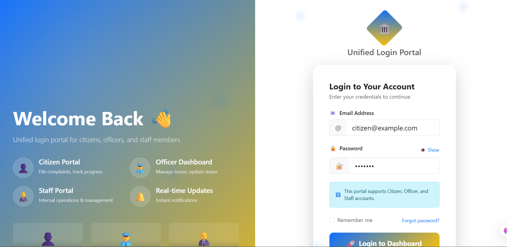
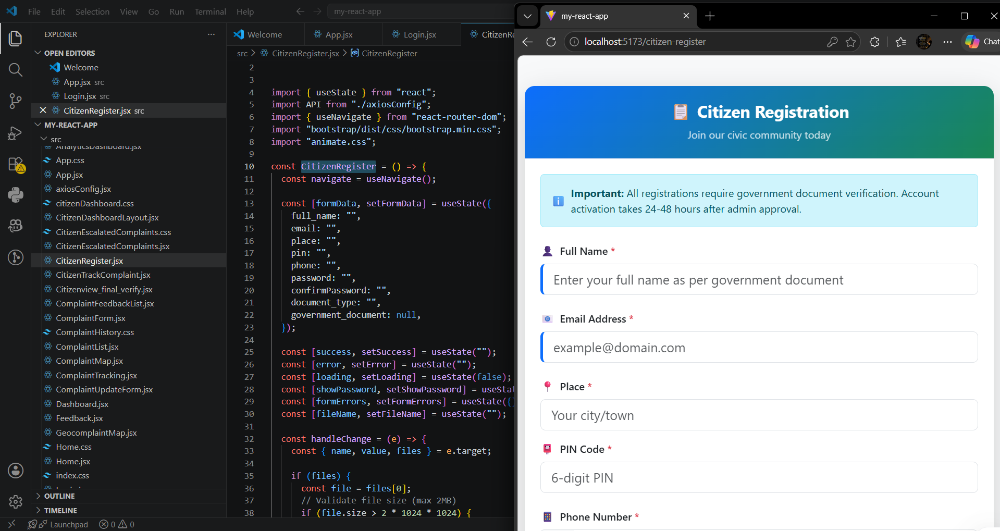
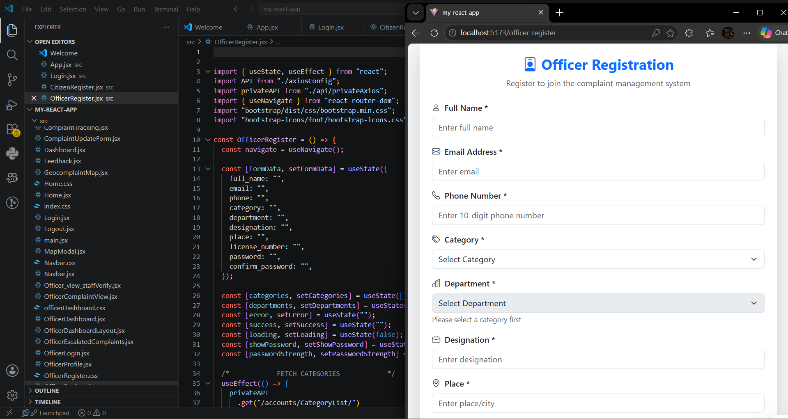
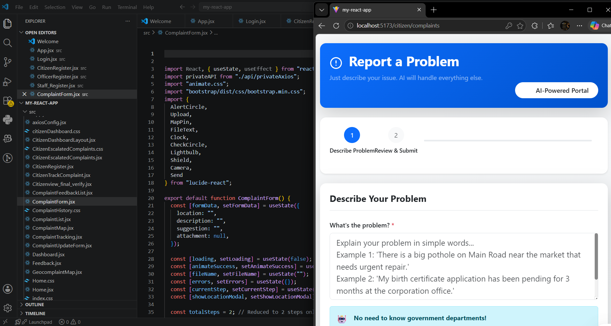
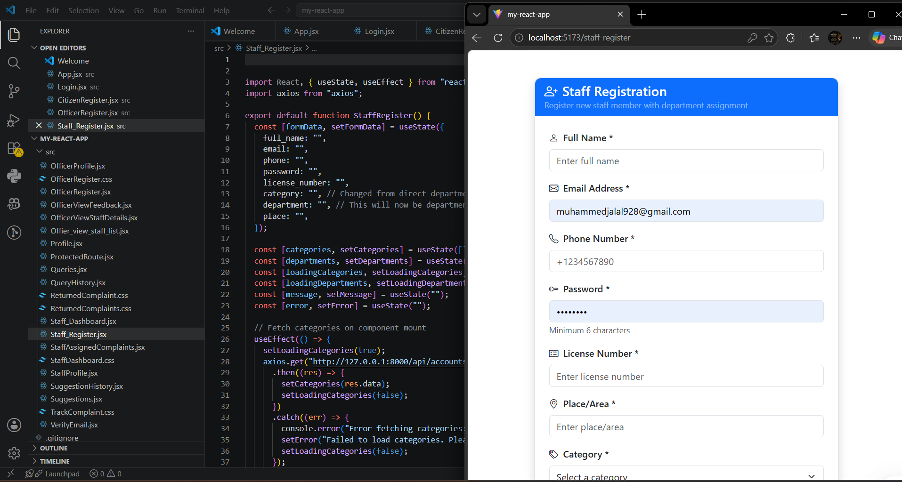

# 🏛️ Civic Complaint Management System

A full-stack web application that allows citizens to submit, track, and manage civic complaints. Built with **Django REST Framework** (backend) and **React.js** (frontend).

---

## 🌐 Live Demo

**[Click Here to View Live App](https://civic-complaint-system-three.vercel.app)**

---

## 🚀 Features

- 🔐 JWT-based authentication (Citizen & Admin roles)
- 📝 Submit complaints with category, description, and location
- 📊 Admin dashboard to manage and resolve complaints
- 🔄 Real-time complaint status tracking (Pending → In Progress → Resolved)
- 📱 Fully responsive UI across mobile and desktop
- 🗄️ PostgreSQL database with optimized queries

---

## 🛠️ Tech Stack

| Layer | Technology |
|-------|-----------|
| Backend | Python, Django, Django REST Framework |
| Frontend | React.js, HTML5, CSS3, JavaScript |
| Database | PostgreSQL / SQLite |
| Auth | JWT (JSON Web Tokens) |
| Tools | Git, GitHub, Postman, VS Code |

---

## 📸 Screenshots

---

## 📁 Project Structure
